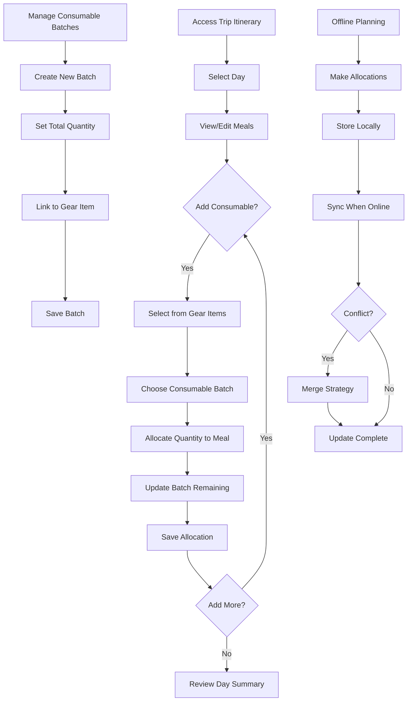

# Consumables per Day/Meal - Product Requirements Document

**Status**: Draft  
**Owner**: Product Team  
**Date**: 2025-08-13  
**Related Issue**: #[TBD]

## Problem Statement

Backpackers need to carefully plan consumable allocation (food, fuel, water purification tablets) across trip days and meals to ensure adequate nutrition while minimizing pack weight. Current trip planning tools lack granular meal-by-meal allocation capabilities, leading to over-packing, under-provisioning, or poor meal distribution that impacts trip enjoyment and safety.

## Goals

### Primary Goals
- Enable precise allocation of consumables by day and meal (breakfast, lunch, dinner, snack)
- Provide real-time tracking of consumable depletion and remaining quantities
- Support collaborative meal planning with conflict-safe offline editing
- Optimize pack weight through accurate portion planning

### Non-Goals
- Nutritional analysis or meal optimization algorithms
- Integration with grocery shopping or meal delivery services
- Real-time consumption tracking during trip (post-trip feature)
- Individual dietary restriction management (separate feature)

## Personas & Target Scenarios

### Primary Persona
- **Who**: Trip organizer/planner (experienced backpacker)
- **Context**: Pre-trip planning phase, often planning for group of 2-6 people
- **Motivation**: Ensure adequate food supply while minimizing weight and waste

### Secondary Persona
- **Who**: Trip participant/collaborator
- **Context**: Contributing to meal planning, reviewing allocations
- **Motivation**: Understand personal food responsibilities and trip logistics

### Key Scenarios
1. Solo trip organizer planning 5-day solo backpacking trip with dehydrated meals
2. Group leader coordinating shared consumables for 4-person weekend trip
3. Collaborative planning where multiple members contribute different meal components

## User Stories

```
As a trip organizer
I want to allocate specific quantities of consumables to each day and meal
So that I can ensure adequate nutrition without over-packing
```
**Priority**: Must Have

```
As a trip planner
I want to see remaining quantities after allocation
So that I can identify shortfalls or excess before the trip
```
**Priority**: Must Have

```
As a collaborative planner
I want to work offline and sync changes later
So that planning can continue without internet connectivity
```
**Priority**: Must Have

```
As a group trip organizer
I want to optionally assign consumables to specific members
So that cooking responsibilities and pack weight can be distributed
```
**Priority**: Should Have

```
As a trip participant
I want to see my personal consumable allocation
So that I know what to pack and my cooking responsibilities
```
**Priority**: Should Have

## User Flows



## Data Model Touchpoints

### Entities Affected
- **Trip**: Root entity containing all itinerary and planning data
- **ItineraryDay**: Represents a single day in the trip timeline
- **ConsumableBatch**: Tracks quantity and depletion of specific consumable items
- **MealAllocation**: Links ConsumableBatch to specific ItineraryDay and meal type
- **GearItem**: Base consumable item definition (type: consumable)

### New Entities
- **MealAllocation**:
  - `id`, `itinerary_day_id`, `consumable_batch_id`
  - `meal_type` (breakfast/lunch/dinner/snack)
  - `allocated_quantity` (grams/ml/units)
  - `assigned_member_id` (optional)
  - `created_at`, `updated_at`, `version`

- **ConsumableBatch**:
  - `id`, `trip_id`, `gear_item_id`
  - `total_quantity`, `remaining_quantity`
  - `unit_type`, `batch_name`
  - `created_at`, `updated_at`, `version`

### API Requirements
- `/trips/:id/consumable_batches` - CRUD operations for batches
- `/trips/:id/meal_allocations` - CRUD operations for allocations
- `/itinerary_days/:id/meal_allocations` - Day-specific allocation views
- Conflict resolution endpoints for offline sync

## Success Metrics

### Primary Metrics
- **Adoption Rate**: 70% of trips with 3+ days use consumable allocation
- **Completion Rate**: 80% of users complete allocation for all trip days
- **Sync Success**: 99% of offline changes sync without data loss

### Secondary Metrics
- **Planning Time**: Reduced time to complete trip consumable planning
- **User Satisfaction**: Positive feedback on allocation accuracy and ease of use
- **Collaboration Usage**: % of multi-member trips using shared allocation

## Open Questions

- [ ] **Batch Depletion Rules**: Should partial allocations automatically reduce remaining batch quantity, or require explicit "consumption" action?
- [ ] **Leftover Handling**: How should the system handle partial consumables that carry over between days (e.g., partially used fuel canister)?
- [ ] **UX for Rebalancing**: If a batch runs out mid-trip planning, how should the system help redistribute existing allocations?
- [ ] **Member Assignment Granularity**: Should member assignment be per-allocation or per-batch?
- [ ] **Unit Conversion**: Should the system support automatic conversion between weight/volume units?
- [ ] **Meal Templates**: Should users be able to save and reuse common meal allocation patterns?

## Acceptance Criteria

### Functional Requirements
- [ ] User can create consumable batches with total quantities
- [ ] User can allocate portions from batches to specific day/meal combinations
- [ ] System tracks remaining quantities and prevents over-allocation
- [ ] User can view day-by-day and meal-by-meal allocation summary
- [ ] User can reassign allocations between days/meals
- [ ] User can delete allocations and restore batch quantities
- [ ] Multiple users can edit allocations simultaneously with conflict resolution

### Technical Requirements
- [ ] All allocation operations work offline with local storage
- [ ] Offline changes sync with conflict-safe merge strategies
- [ ] Data consistency maintained across multiple concurrent editors
- [ ] API responses under 200ms for allocation CRUD operations
- [ ] Allocation data persists across app restarts
- [ ] Version control prevents lost updates during sync conflicts

### UX Requirements
- [ ] Mobile-responsive interface for allocation management
- [ ] Visual indicators for batch depletion status (full/partial/empty)
- [ ] Clear error messages for over-allocation attempts
- [ ] Intuitive drag-and-drop or quick-add allocation methods
- [ ] Loading states during sync operations
- [ ] Accessibility support for screen readers and keyboard navigation
- [ ] Offline mode clearly indicated to users

---

**Next Steps**: Create wireflow design for consumable allocation interface and batch management flows