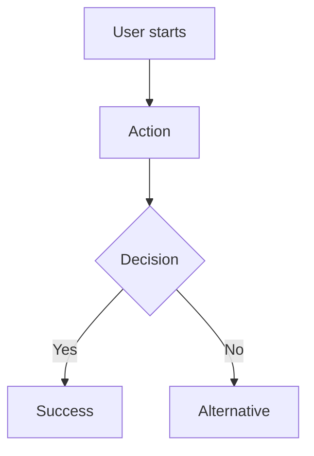

# [Feature Name] - Product Requirements Document

**Status**: Draft | In Review | Approved  
**Owner**: [Name]  
**Date**: [YYYY-MM-DD]  
**Related Issue**: #[issue-number]

## Problem Statement

[What problem are we solving? Why is this important now?]

## Goals

### Primary Goals
- [What we want to achieve]
- [Measurable outcomes]

### Non-Goals
- [What we explicitly won't address]
- [Out of scope items]

## Personas & Target Scenarios

### Primary Persona
- **Who**: [User type]
- **Context**: [When/where they use this]
- **Motivation**: [Why they need this]

### Key Scenarios
1. [Scenario 1: Description]
2. [Scenario 2: Description]

## User Stories

```
As a [persona]
I want [capability]
So that [benefit]
```

**Priority**: Must Have | Should Have | Could Have

## User Flows



## Data Model Touchpoints

### Entities Affected
- [Entity 1]: [Changes needed]
- [Entity 2]: [New relationships]

### API Requirements
- [Endpoint]: [Purpose]
- [Data format]: [Requirements]

## Success Metrics

### Primary Metrics
- [Metric 1]: [Target]
- [Metric 2]: [Target]

### Secondary Metrics
- [Leading indicators]
- [User engagement metrics]

## Open Questions

- [ ] [Question 1]
- [ ] [Question 2]

## Acceptance Criteria

### Functional Requirements
- [ ] [Requirement 1]
- [ ] [Requirement 2]

### Technical Requirements
- [ ] [Performance criteria]
- [ ] [Offline behavior]
- [ ] [Sync behavior]

### UX Requirements
- [ ] [Mobile responsive]
- [ ] [Accessibility standards]
- [ ] [Error states handled]

---

**Next Steps**: [Link to wireflow or technical design]