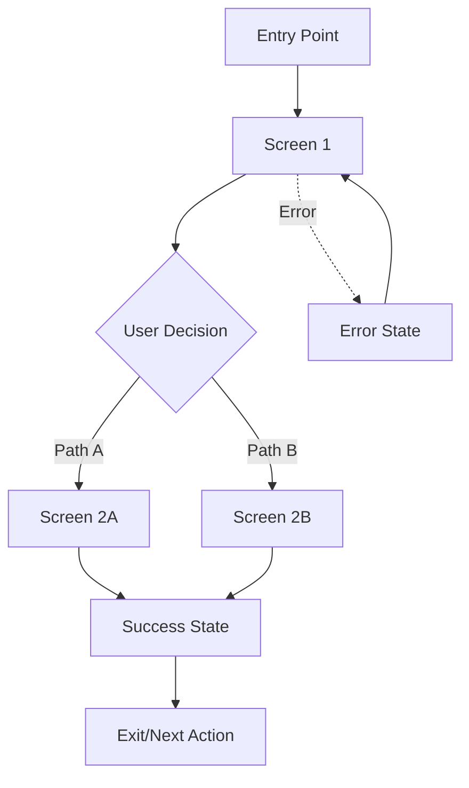

# [Feature Name] - Wireflow Design

**Status**: Draft | In Review | Approved  
**Designer**: [Name]  
**Date**: [YYYY-MM-DD]  
**Related PRD**: [Link to product spec]  
**Related Issue**: #[issue-number]

## Feature Overview

[Brief description of the feature being designed]

## Assumptions

- [Assumption 1: Technical or user behavior]
- [Assumption 2: Business constraint]
- [Assumption 3: Platform capability]

## Mobile-First User Flow

## Screen Inventory

### Screen 1: [Screen Name]
**Purpose**: [What this screen accomplishes]  
**Layout**: [Brief layout description]

**Key Elements**:
- [Element 1]: [Function]
- [Element 2]: [Function]
- [CTA]: [Primary action]

**States**:
- Loading: [Behavior]
- Error: [Error handling]
- Empty: [Empty state behavior]

---

### Screen 2: [Screen Name]
[Repeat structure for each screen]

## Visual Assets

### Wireframes
- [ ] `wireframe-[feature]-[screen].png` - [Description]
- [ ] `wireframe-[feature]-[screen].png` - [Description]

### Exported Designs
- [ ] `design-[feature]-[screen].png` - [High-fi design]
- [ ] `prototype-[feature].mp4` - [Interactive prototype]

## Edge Cases & Offline Behavior

### Offline States
- **No Connection**: [How feature behaves]
- **Sync Conflict**: [Resolution strategy]
- **Partial Data**: [Graceful degradation]

### Error States
- **Validation Error**: [User feedback]
- **Server Error**: [Retry mechanism]
- **Permission Denied**: [Alternative path]

### Edge Cases
- **Empty Data**: [First-time user experience]
- **Maximum Limits**: [Boundary behavior]
- **Slow Connection**: [Progressive loading]

## Accessibility Notes

### Screen Reader Support
- [Semantic markup requirements]
- [ARIA labels needed]

### Keyboard Navigation
- [Tab order]
- [Keyboard shortcuts]

### Visual Accessibility
- [Color contrast requirements]
- [Text size considerations]
- [Icon alternatives]

## Platform Considerations

### LiveView Web
- [Web-specific behaviors]
- [Responsive breakpoints]

### LiveView Native iOS
- [iOS-specific patterns]
- [Native gesture support]

## Acceptance Criteria

### Functional
- [ ] [User can complete primary flow]
- [ ] [All interactive elements work]
- [ ] [Data validation functions]

### Visual
- [ ] [Matches design specifications]
- [ ] [Responsive on all screen sizes]
- [ ] [Loading states implemented]

### Technical
- [ ] [Offline functionality works]
- [ ] [Sync behavior correct]
- [ ] [Performance meets targets]

### Accessibility
- [ ] [Screen reader accessible]
- [ ] [Keyboard navigable]
- [ ] [WCAG 2.1 AA compliant]

---

**Implementation Notes**: [Any specific technical considerations]  
**Next Steps**: [Link to implementation issue or next design phase]